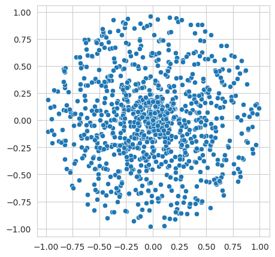
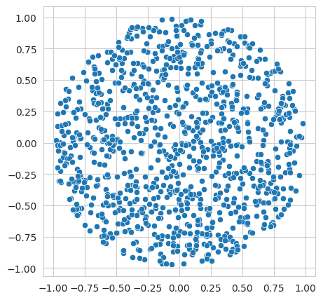

# A. Генератор точек в круге

### Условие задачи

Петя написал два генератора точек в круге:

```
def generate1():
    a = uniform(0, 1)
    b = uniform(0, 1)
    return (a * cos(2 * pi * b), a * sin(2 * pi * b))
```

```
def generate2():
    while True:
        x = uniform(-1, 1)
        y = uniform(-1, 1)
        if x ** 2 + y ** 2 > 1:
            continue
        return (x, y)
```

Даны 100 наборов по 1000 точек, каждый набор сгенерирован каким-то одним из этих двух алгоритмов. Необходимо определить для каждого набора, первый или второй алгоритм использовался для его генерации.

Для того, чтобы получить ОК по этой задаче, надо предсказать правильный генератор хотя бы для 98 наборов.


### Формат ввода

Даны 100 строк. Каждая строка отвечает за свой набор точек.
В каждой строке находится 2000 действительных чисел $\(-1 <= a_i <= 1),$ разделённых пробелом. Точки идут подряд, то есть формат строки: $x_0 \ y_0 \ x_1 \ y_1 \ x_2 \ y_2 \ \dots \ x_{999} \ y_{999}$

### Формат вывода

Нужно вывести 100 строк, в каждой из которой должно быть 1 число: 1 или 2, в зависимости от того, первым или вторым генератором был сгенерирован данный набор точек.

### Решение

В первом генераторе используется параметрическое уравнение круга $x\=r⋅cos(θ),y\=r⋅sin(θ)$

В втором генераторе проверяется условие $ x2+y2≤1 $

При визуализации наборов точек от каждого генератора видно, что в первом случае множество точек плотно расположись в центре. Во втором же случае точки располагаются равномерно.

Визуализация набора точек 1-го генератора:
 


Визуализация набора точек 2-го генератора: 



Чтобы определить к какому генератору относится каждый набор вычислим расстояние от центра до каждой точки по формуле $\ sqrt(x^2 + y^2),$ и сравним среднее значение расстояния с 0.5


